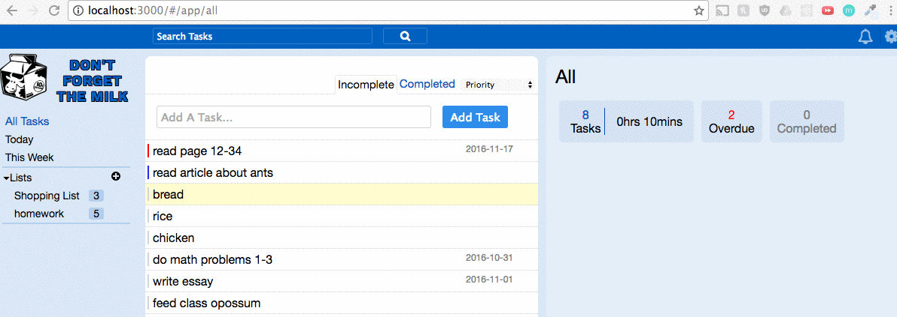
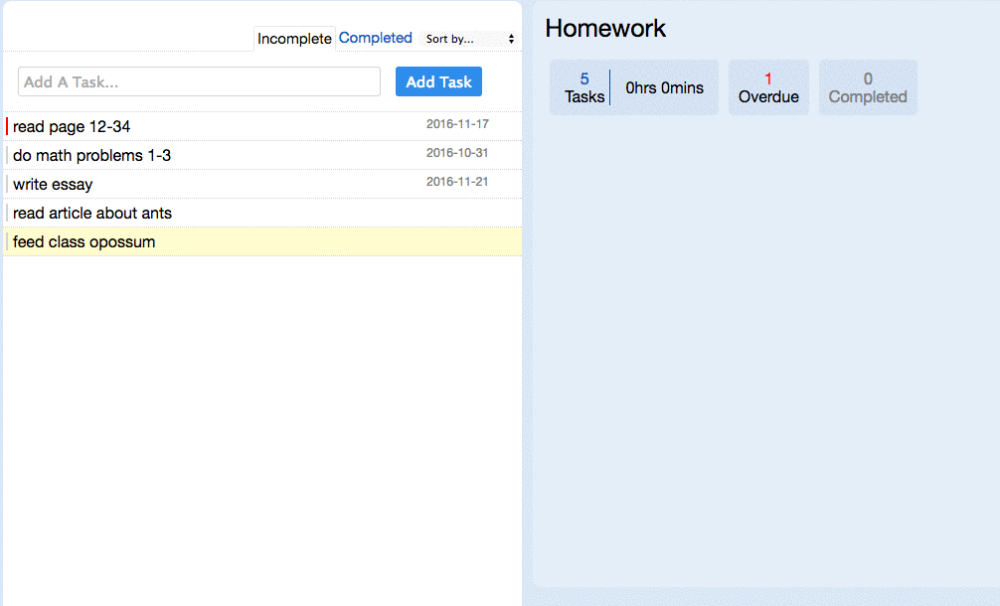

# Don't Forget The Milk

[Live Site](http://dontforgetmilk.herokuapp.com)

Don't Forget The Milk is a single page web application allowing users to make and organize to-do lists. It is inspired by Remember The Milk. It is built on a React/Redux frontend with a Ruby on Rails and PostgreSQL backend.

## Features

 Don't Forget The Milk allows users to:

* Create, edit and delete to-do lists
* Create, edit and delete tasks in to-do lists
* Edit the name, priority, start date, due date, time estimate and completion of a task.
* Move tasks between lists.
* View a summary of a list which includes: number of completed and incomplete tasks, total time of tasks and number of overdue tasks
* Sort tasks by priority, due date, start date, date created, or time estimate
* Search for tasks
* View all tasks or tasks sorted by due date of today or in the next week

## Intuitive URLs

Because Don't Forget The Milk is a single page web app, the user is never redirected from the root URL. By using the React Router package Don't Forget The Milk is able to give every location in the app a descriptive URL without reloading the page. This allows a user to navigate smoothly using the back and forward buttons and even to navigate to a specific list or task with a bookmarked URL.



## Task Sorting

Within any list the tasks can be sorted based on their dates, prirority or the estimated time they will take. This feature automatically updates the order of tasks when they are updated. 




## Efficient SQL

In order to keep the site responding quickly the SQL queries are optimized to reduce requests to the database. In this code the users lists are loaded along with the count of the tasks in each to be sent and displayed in the frontend.

```ruby

  def self.user_lists_with_task_count(user)
    self.find_by_sql(<<-SQL)
      SELECT 
        lists.*, 
        COUNT(tasks.*) AS count 
      FROM
        lists
      INNER JOIN 
        tasks
      ON 
        tasks.list_id = lists.id 
      WHERE 
        lists.user_id = #{user.id} AND tasks.completed = false
      GROUP BY 
        lists.id
    SQL
  end
  ```

## Future Features

I plan to add the following features to Don't Forget the Milk:

* Users can add locations to tasks and view tasks by location using the Google Places API
* Users receive notification emails reminding them of tasks due or starting the current day
* Users can add tags to tasks and view tasks based on tags
* Users can create smart lists based on inclusion or exclusion of words